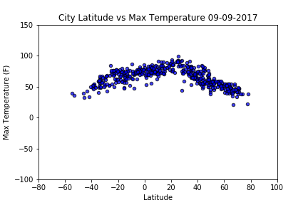
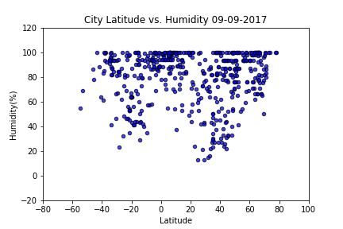
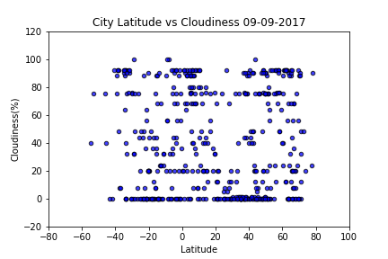
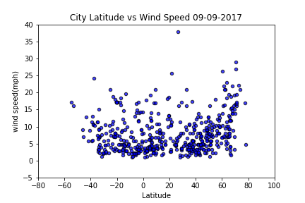

# What's the weather like as we approach the equator?

<h2>Synopsis</h2>
What's the weather like as we get closer to the equator?  The main question that will be answered in this analysis.  In order to answer this question, I randomly selected 500 cities from around the world using the citipy library.  Then, I look at current weather conditions in those cities using api call from openweather source.

--------------------------
First I look at what happened to temperature as we move closer to the equator.

We see that max temperature is higher in cities that are closer to the equator.  However, as we move away from the equator, we see that temperature get lower readily.

---------------------------
When we look at what happened to humidity as we approached equator.

We see that humidity generally higher than in cities closer to the equator compared to cities that are farther away, which the humidty is varied greatly.

----------------------------
What happened to cloud density as we approached equator?

We see there is no relation between cloudiness and cities' location relative to equator.

------------------------------
How's the wind speed as we approached the equator?

We also see there is no relationship between wind speed and cities' location relative to the equator.

-----------------------------

<h2>Summary</h2>
In general, we see that as we get closer to the equator temperature get increased, humidity generally get increased, however, cloudiness and wind speed are not affected.

-------------------------------

<strong>Libraries Used.</strong>

[simple Python library](https://pypi.python.org/pypi/citipy)

[OpenWeatherMap API](https://openweathermap.org/api)

<strong>Technologies Used.</strong>

Python and Pandas library
